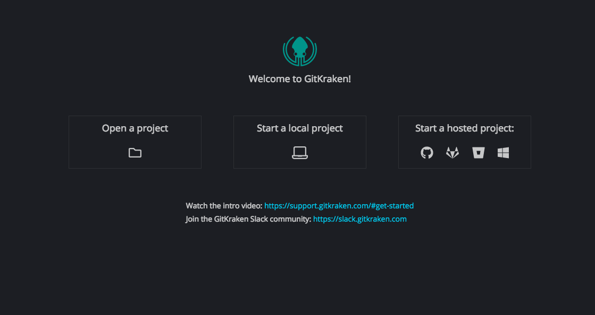
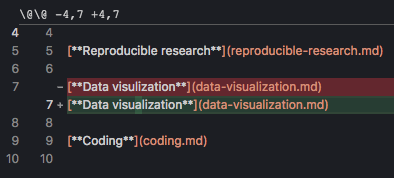

# Git

"Version Control System" is the technical/software term used to describe Git and the term that will come up most often when it is googled. But Git can be used by **anybody** and will most probably improve the quality of your work if you decide to use it when writing papers, code etc.

**If you have any questions, technical issues, or feedback on any part of this document feel free to contact Yulric Sequeira either on Microsoft Teams or by email at ysequeira@ohri.ca**

## What is Git

Git is used to track files and these can range from simple text files, program files like ones written for R, Javascript, and CSV files, etc. (don't try it with MS Word files though since these are binary files). You should use Git if you....

- Want to avoid the versioning hell using file names. If you have a folder where the file names look like "File_2018-01-11.txt", "File_2018-01-11-final.txt" etc., then use Git! It avoids this entire issue by using a concept called commits.
- Want to know exactly what changes were made from one version of a file to another. This is one of the most powerful features of Git and is not only built into it but also a host of programs exist online that show this in an intuitive way
- Want a workflow that encourages collabration rather than hindering or discouraging it. Git has features like branching, stashing etc. that makes collabaration painless
- Are tired of contiously making copies of files before making changes to them due to fear of making a mistake, overwriting somebody else's work etc.

Convinced? Then read on

## Things you will need

If you are a first time Git user then we highly recommend starting out with Git Kracken https://www.gitkraken.com/git-client.

Once you have downloaded, installed and run the program you will need to login using your Github credentials. There should be a button named "Sign in with github". This will open up your browser and you should follow the instructions there to get everything setup

Continue to the next section only after you reach a screen with a button named "Open a project" 

## Basic Git Concepts (or how to earn a PBL sticker!)

The next few sections provide a practical introduction at the end of which if everything goes right (fingers crossed) your name should appear here https://github.com/Big-Life-Lab/Welcome/blob/master/our-team.md

### Repositories and Cloning

Before you can start using various git features you have to first start or download a git project also called a **repository**. A git repository is just a folder on your computer that has git attached to it. There are 2 ways to create a git repository:

1. Downloading or **cloning** an existing repository
2. Starting your own repository

We will be focusing on the first way of starting a repository but if you are interested in number 2 these videos should help you:

- https://www.youtube.com/watch?v=A-4WltCTVms Goes over what a git repository is in video form and how to create one
- https://www.youtube.com/watch?v=XXt95X8U1Dc Another video that goes over how to create a new repository. A small note on timestamp 00:16 when he selects his github account. You will have at least 2 account to select from, one of them will be your personal account represented by your github username and the other one will be Big-Life-Lab which is our organization's account. For personal projects you should use your github account and for projects that pertain to our organization you should use the Big-Life-Lab account

Let's clone or download the Welcome repo (short for repository) into our computer. This article goes over how to do this in git kracken https://blog.axosoft.com/remote-repository/ and this is the link to the repo https://github.com/Big-Life-Lab/Welcome.

If everything went well then you should have the Welcome repo on your computer. Congrats! you have successfully created a git repo!

### Adding, Staging and Commiting

A git commit is analogous to saving a file after you have made edits. In git, however, it is more than saving. Think of a commit like taking a photograph of the current state of your work and then writing a note on the photo of what has changed compared to your previous photo.

Before you commit your work, git requires you to **add** or **stage** all the files that go into the commit (the photo) into what it calls a **staging** area. This gives you more fine grained control at the file level to decide what goes into a commit. Going back to the photograph analogy, before actually taking the photo you decide and **add** all the items that will go into the photo into the **staging** area and then **commit** (click) the photo.

In this step you will create a commit that adds your name to the our-team.md file.

First modify the our-team.md file. This is a markdown file. Each section in a markdown file starts with a ## followed by the name of the section. Add your name to whatever section you feel you belong to by typing - followed by your name in a new line. Look at line 5 in the our-team.md file for an example.

Next follow the instructions here https://www.youtube.com/watch?v=9YCO-3_MApI to commit your changes in Gitkracken. Note: in the video they say "to **stage** a file".

And you have sucessfully made your first ever commit!

### Local Repo, Remote Repo, Pushing and Pulling

Git allows you to sync all the changes you have made to a repo on your computer with the cloud. If you have ever used a tool like Dropbox, Microsoft OneDrive or Google Drive it works almost the same way.

Before we define what syncing in git does, we should go over the concept of a **local** and **remote** repo

A **local** repo is a git repo that is on your computer. For eg., the Welcome repo that is currently on your computer is a local repo

A **remote** repo is a git repo that is not on your computer. For eg., the Welcome repo that you see when you go to this link https://github.com/Big-Life-Lab/Welcome is a remote repo that is stored on github's computers

Remote repos allow you to backup your project so that you don't lose anything in case of a computer failure, so you can work on the project when you switch computers and so other people can see your work

Local repos allow you to make changes to your project without showing those changes to anybody else or affecting somebody else' work

**Syncing** in git means to **pull** or download all the commits that are in a **remote** repo which you do not have to your **local** repo and to **push** or upload all the commits that are in your **local** repo which a **remote** repo does not have to the remote repo.

You can also decide to just push or to just pull in changes.

Currently you have one commit in your local repo that needs to be pushed to github or the remote repo. We will do this now.

1. If you look at the left hand side of git kracken you should see a section called LOCAL and underneath that the text master. If you did the previous section correctly you should see an arrow pointing upwards with the number 1 next to it. This means that you have one commit in your local repo that github does not have. Similarly if there's a downward arrow then there are commits in github that you do not have on your computer.
2. Push this commit to github (which is the commit you created in the last section) by clicking the Push button at the very top center of git kracken
3. Verify that your push was successful by going to the Welcome repo in github https://github.com/Big-Life-Lab/Welcome  Also your name should appear here https://github.com/Big-Life-Lab/Welcome/blob/master/our-team.md

Wonderful! You have successfuly pushed your changes to github

## Diffing

In the last section on "Basic Git Concept" we will go over git diffs. Git difs are a powerful feature that not only allow us to see what files have changed from one commit to another but also what exactly has been changed in each file.

In Gitkracken the middle panel shows all the commits that have been made in the repo in chronological order. Your commit should be at the very top and should be distinguishable by the commit message.

Click on your commit now.

While a commit is selected the right most panel shows the changes made in the commit at the file level. There are 3 types of file changes and git kracken distinguishes between them by using icons:

-  This file was added in the commit
-  This file was removed in the commit
-  This file was modified in the commit. This means lines were added, removed or modified

In the right hand panel currently you should see only one file "our-team.md"

Clicking on the modified file in this panel tells you exactly what changes were made to the file. For example:

-  This says that line 7 was modified and the letter 'a' was added to the word visualization
-  This says that lines 20 to 22 were added to this file
-  This says that line 14 was removed from this file

Click the our-team.md file in the right hand panel to see the line you added to the file

### What next?

If you have completed all the parts in this section then congrats! You have earned a PBL sticker which Karen Pacheco should be happy to give to you provided you show proof of your work. There are still other poweful git features outlined in the Advanced Git Concepts section however these should be more than enough to get you going. Happy gitting!

## Advanced Git Concepts (WIP)

### Branching and Checkout (WIP)

### Stashing (WIP)

### Pull Requests (WIP)

## How to Git

[Getting started with Git.](https://git-scm.com/book/en/v1/Getting-Started-Git-Basics)

## Git tips, etiquette and workflow

> Please contribute to how best to use Git in our teams.

Ten Simple Rules for Taking Advantage of Git and GitHub. A paper in [Computational Biology](https://www.ncbi.nlm.nih.gov/pmc/articles/PMC4945047/) describes well-estiablished Git practice and how that practice can be used in research.

> Is there anything you don't like about this suggested approach? If there is, make an [Issue](https://github.com/Big-Life-Lab/Welcome/issues)

A course for researchers from the [Software Carpentry](https://swcarpentry.github.io/git-novice/).
